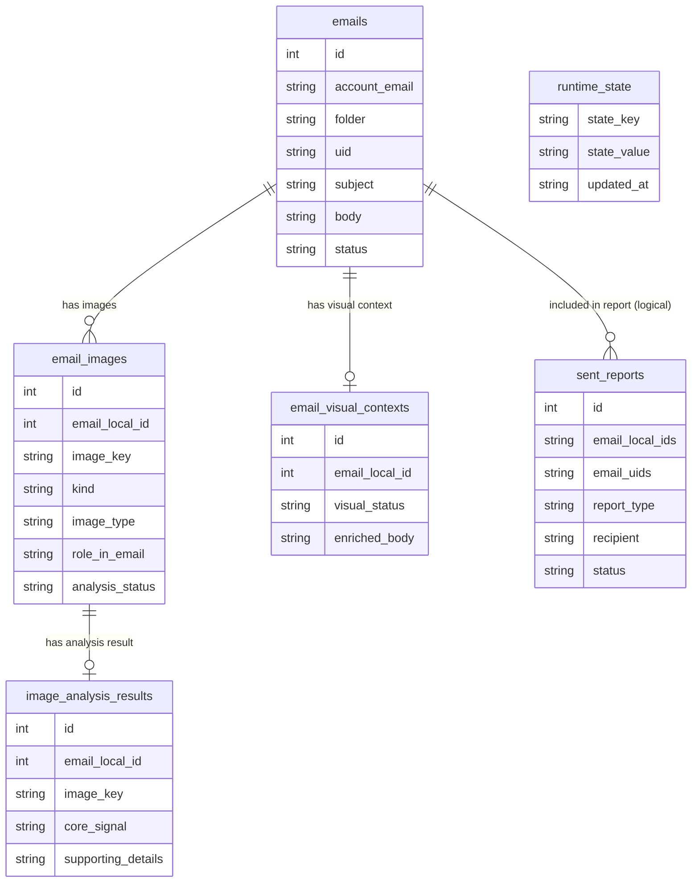
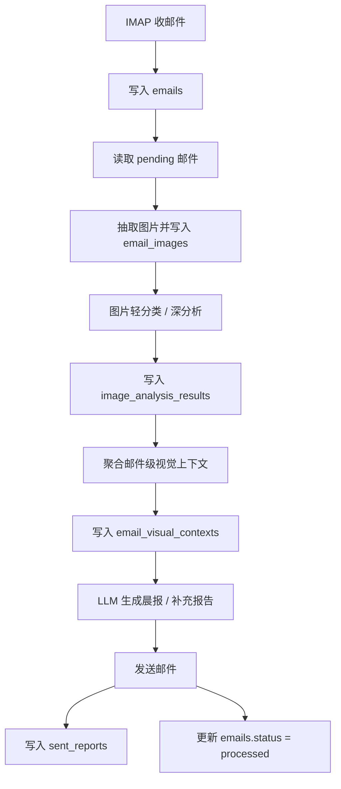

# Database Schema

本项目当前使用 1 个本地数据库：SQLite。

- 数据库文件：`emails.db`
- 数据库定义入口：[app/storage/email_db.py](/Users/yyukichen/Desktop/email-service-research-assistant/app/storage/email_db.py)

## 总览

当前数据库包含 6 张表：

1. `emails`
2. `sent_reports`
3. `runtime_state`
4. `email_images`
5. `image_analysis_results`
6. `email_visual_contexts`

其中：

- `emails` 是主表，核心对象是一封邮件
- `sent_reports` 记录一次晨报或补充报告的发送结果
- `runtime_state` 记录最近一次运行状态、错误和时间戳
- `email_images` 记录邮件中拆出的图片及其预处理状态
- `image_analysis_results` 记录高价值图片的深分析结果
- `email_visual_contexts` 记录回填到邮件分析阶段的邮件级视觉上下文

## 表关系图

## 业务流程图

## 各表字段说明

### `emails`

用途：存储系统中的核心邮件记录，是全流程的主表。

| 字段 | 含义 |
|------|------|
| `id` | 本地自增主键 |
| `account_email` | 这封邮件所属的邮箱账号 |
| `folder` | 邮件所在文件夹，如 `INBOX` |
| `uid` | 邮箱服务器上的 UID |
| `email_from` | 发件人地址原始值 |
| `from_name` | 发件人名称 |
| `to_addr` | 收件人地址 |
| `subject` | 邮件主题 |
| `date` | 邮件原始时间 |
| `body` | 邮件正文 |
| `attachments` | 附件信息，通常是 JSON 字符串 |
| `status` | 邮件处理状态，常见为 `pending` / `processed` |
| `created_at` | 这封邮件写入本地数据库的时间 |
| `processed_at` | 这封邮件被处理完成的时间 |

补充：

- 唯一性按 `(account_email, folder, uid)` 控制
- 这是后续图片链路、报告发送链路的基础表

### `sent_reports`

用途：记录一次报告发送行为及其对应的邮件范围。

| 字段 | 含义 |
|------|------|
| `id` | 本地自增主键 |
| `email_local_ids` | 本次报告覆盖的本地邮件 ID 列表，JSON 字符串 |
| `email_uids` | 本次报告覆盖的服务器 UID 列表，JSON 字符串 |
| `report_type` | 报告类型，如 `daily` 或 `supplement` |
| `subject` | 发送出去的报告主题 |
| `recipient` | 收件人邮箱 |
| `sent_at` | 发送时间 |
| `status` | 发送结果，常见为 `success` / `failed` |

补充：

- 这张表和 `emails` 是逻辑关联，不是数据库外键
- 一次报告可能覆盖多封邮件，因此这里用 JSON 字符串存列表

### `runtime_state`

用途：保存运行时级别的小状态，例如最近一次处理日期、最近检查时间、最近错误信息。

| 字段 | 含义 |
|------|------|
| `state_key` | 状态键 |
| `state_value` | 状态值，JSON 字符串 |
| `updated_at` | 最近更新时间 |

补充：

- 这张表不是业务主表，而是运行时控制面的小型键值表
- 当前 CLI / 服务分析链会复用它来记录最近运行情况

### `email_images`

用途：记录单封邮件拆出的每张图片，以及它在图片预处理链路中的状态。

| 字段 | 含义 |
|------|------|
| `id` | 本地自增主键 |
| `email_local_id` | 关联的邮件本地 ID，对应 `emails.id` |
| `image_key` | 图片唯一标识 |
| `kind` | 图片类型，如附件图、内嵌图 |
| `source_location` | 图片来源位置，如 `attachment` / `inline` |
| `inline_index` | 如果是正文内嵌图，这是第几张 |
| `filename` | 图片文件名 |
| `content_type` | 图片 MIME 类型 |
| `size` | 图片大小 |
| `sha256` | 图片内容哈希 |
| `prescreen_status` | 本地预筛状态 |
| `prescreen_reasons` | 本地预筛原因，通常是 JSON 字符串 |
| `image_type` | 图片轻分类后的类型 |
| `role_in_email` | 图片在邮件中的角色 |
| `analysis_status` | 当前图片分析状态，如 `pending` / `classified` / `analyzed` |
| `created_at` | 记录创建时间 |
| `updated_at` | 记录更新时间 |

补充：

- 唯一性按 `(email_local_id, image_key)` 控制
- 这是多模态链路里的“图片中间表”

### `image_analysis_results`

用途：记录高价值图片经过深分析后的结构化结论。

| 字段 | 含义 |
|------|------|
| `id` | 本地自增主键 |
| `email_local_id` | 关联的邮件本地 ID |
| `image_key` | 对应图片标识 |
| `core_signal` | 这张图最核心的结论或信号 |
| `supporting_details` | 图片相对核心结论的补充信息，通常是 JSON 字符串 |
| `created_at` | 记录创建时间 |
| `updated_at` | 记录更新时间 |

补充：

- 唯一性按 `(email_local_id, image_key)` 控制
- 逻辑上它和 `email_images` 一一对应

### `email_visual_contexts`

用途：保存聚合后的邮件级视觉上下文，供主摘要阶段复用。

| 字段 | 含义 |
|------|------|
| `id` | 本地自增主键 |
| `email_local_id` | 关联的邮件本地 ID |
| `visual_status` | 视觉上下文状态，如 `empty` / `ready` |
| `inline_visual_contexts` | 偏主叙事的视觉上下文块，通常是 JSON 字符串 |
| `supporting_visual_evidence` | 偏支撑证据的视觉块，通常是 JSON 字符串 |
| `enriched_body` | 将视觉上下文拼接回邮件后的增强正文 |
| `created_at` | 记录创建时间 |
| `updated_at` | 记录更新时间 |

补充：

- 一般是一封邮件对应一条聚合结果
- 这张表主要用于缓存和复用视觉理解结果，避免重复分析

## 关键关联说明

### `emails` 和 `email_images`

- 关系：一对多
- 含义：一封邮件里可能有多张图片
- 关联键：`email_images.email_local_id -> emails.id`

### `email_images` 和 `image_analysis_results`

- 关系：逻辑上一对一或零对一
- 含义：不是每张图片都会进入深分析，只有高价值图片才会产生结果
- 关联键：`email_local_id + image_key`

### `emails` 和 `email_visual_contexts`

- 关系：一对一或零对一
- 含义：一封邮件最多有一份聚合后的邮件级视觉上下文
- 关联键：`email_visual_contexts.email_local_id -> emails.id`

### `emails` 和 `sent_reports`

- 关系：多对多的逻辑关系
- 含义：一次报告可能覆盖多封邮件，一封邮件理论上也可能被多次报告引用
- 存储方式：`sent_reports.email_local_ids` 和 `sent_reports.email_uids` 以 JSON 字符串记录

## 最常见的数据流

### 1. 收邮件

- IMAP 拉取新邮件
- 写入 `emails`
- 新邮件默认状态通常为 `pending`

### 2. 图片预处理

- 从 `emails.attachments` 和正文内嵌图里抽取图片
- 将候选图片写入 `email_images`
- 记录预筛、轻分类、分析状态

### 3. 图片深分析

- 高价值图片进入多模态深分析
- 结果写入 `image_analysis_results`

### 4. 聚合视觉上下文

- 把图片级结论汇总成邮件级上下文
- 写入 `email_visual_contexts`
- 同时生成 `enriched_body`

### 5. 生成并发送报告

- 读取 `emails` 中的待处理邮件
- 结合视觉上下文做主摘要生成
- 成功发送后写入 `sent_reports`
- 对应邮件更新为 `processed`

## 哪些字段最关键

如果只看最核心的业务链路，优先关注这些字段：

- `emails.id`
- `emails.account_email`
- `emails.folder`
- `emails.uid`
- `emails.status`
- `email_images.email_local_id`
- `email_images.image_key`
- `email_images.analysis_status`
- `image_analysis_results.core_signal`
- `email_visual_contexts.visual_status`
- `email_visual_contexts.enriched_body`
- `sent_reports.report_type`
- `sent_reports.sent_at`

## 备注

- 项目当前只有 1 个数据库，类型是 SQLite
- 另有一些状态文件和配置文件会落盘，但它们不是数据库
- 如果后续要做数据治理，建议优先把 `sent_reports` 与 `emails` 的逻辑关联从 JSON 字段逐步演进为显式关系表
